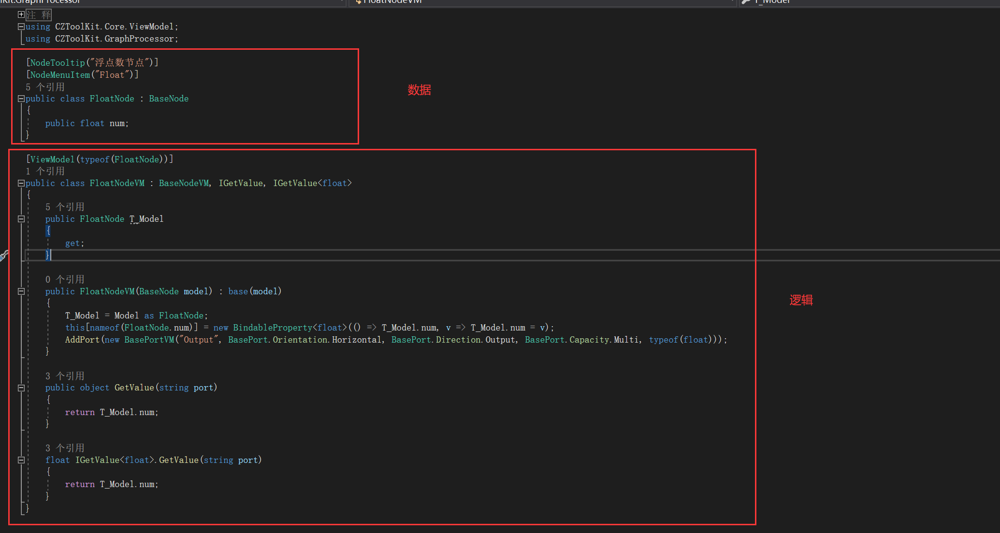
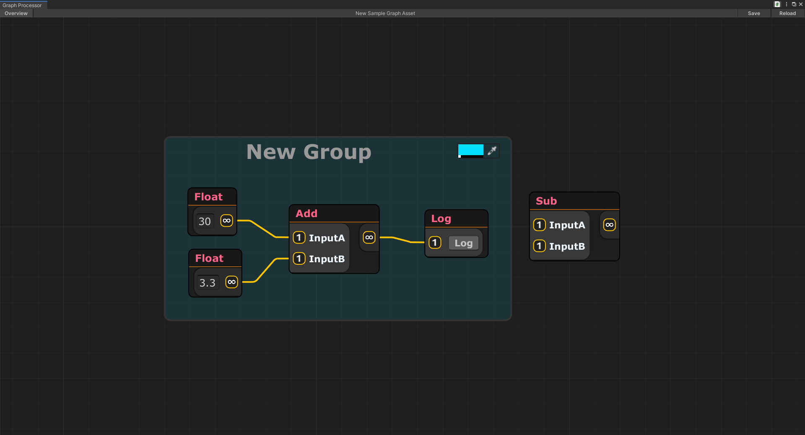

# GraphProcessor
由[NodeGraphProcessor](https://github.com/alelievr/NodeGraphProcessor.git)魔改而来的节点编辑器

MVVM架构

依赖[0.0_Common](https://github.com/HalfLobsterMan/0.0_Common.git)

依赖[Odin Inspector](https://odininspector.com)

> 截图
# 
# 
